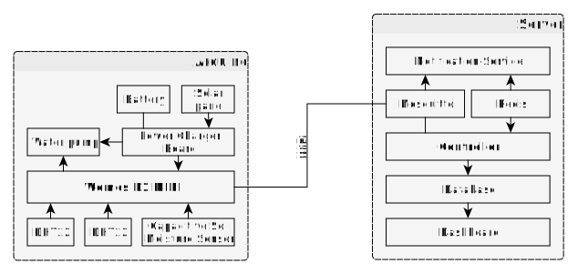

# Greenhouse

This smart greenhouse is controlled with a Wemos D1 MINI (Arduino) and a Raspberry Pi. 

The Wemos runs in the greenhouse. The Pi is in the home network. Since the greenhouse only gets power from a solar cell with battery, the control logic is outsourced to the Pi.
The Arduino wakes up at regular intervals, reports to the Pi via MQTT, which then decides the actions for the Arduino and then sends it "to sleep" again.