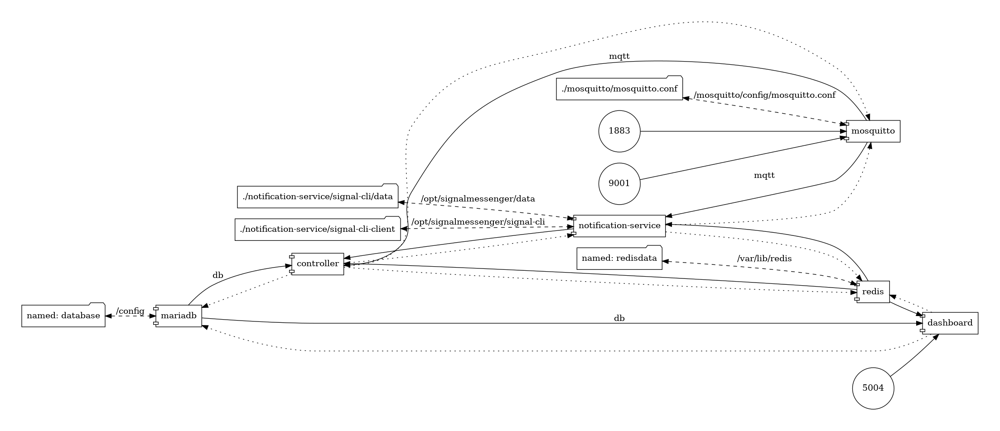

# Greenhouse

## Features

## Setup

### Arduino

### Server

#### Controller

#### Mosquitto

#### Maria DB

#### Notification-Service

# Next steps

- watering based on soil moisture and temperature during the day
- redis configurator in dashboard
- mqtt subsriber on dashboard
  - https://github.com/stlehmann/Flask-MQTT/blob/master/example/app.py
- track battery capacity to controll sleep time
- open window functionallity