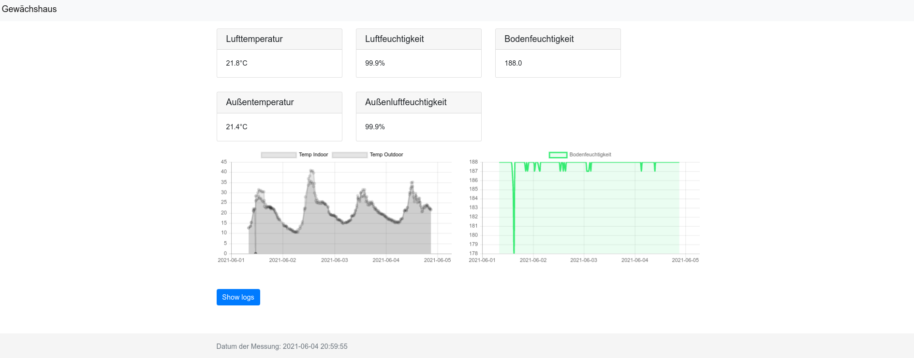

# Greenhouse - Server

The server-side components run in multiple Docker containers, which are managed using docker-compose. These containers are as follows:

- controller: the heart of the greenhouse, decision maker
- dashboard: the gui
- database: mariadb to store all measured data and logs
- redis: to store configuration data
- notification-service: send notifications via [signal messenger](https://signal.org/de/)

## Features

- solar powered greenhouse controller
- Wemos D1 MINI(Arduino)
- Raspberry Pi
- MQTT Connection between Wemos D1 MINI and Raspberry Pi
- Dashboard
  - 

## Setup

Run `docker-compose up` to start all services. For the notification-service are some more configuration steps [necessary](#notification-service)

Available services:

- `{PI-IP}:5004` : dashboard
- `{PI-IP}:8081` : redis management console
- `{PI-IP}:1883`, `{PI-IP}:9001` : mqtt

### Notification-Service

Setup signal-cli like [here](https://github.com/AsamK/signal-cli#installation)

- copy the `signal-cli/data/` folder into `notification-service`
- copy the `/opt/signal-cli-"${VERSION}"` into `notification-service`
- insert `signalsender` and `signalreceiver` as key in redis for both numbers
- 

# further ideas

- watering based on soil moisture and temperature during the day
- redis configurator in dashboard
- mqtt subscriber on dashboard
  - https://github.com/stlehmann/Flask-MQTT/blob/master/example/app.py
- track battery capacity to controll sleep time
- open window functionallity